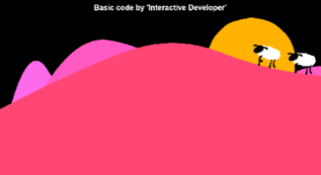

# Sheep

A project to show how many animation effects can be shown in HTML5. This project is packaged as a library with webpack to reuse more easier.

Several mathematical formulas were used for the random position of the hill and the movement positive of the sheep.

The basic code is from the YouTuber `Interactive Developer`, and this video is under this link: https://youtu.be/hCHL7sydzn0

However, this project has been reconstructed in many parts for use later in the project `Rotary` and to make it as library with webpack.

## How to use

Creating an instance by using a constructor of `Sheep` and call animate on this instance recursively with `window.requestAnimationFrame()`.

```js
const sheep = new Sheep();
sheep.resize();
window.requestAnimationFrame(animate);

function animate(curTime) {
  duplicateDraw.animate(curTime);
  window.requestAnimationFrame(animate);
}
```

## Used tools

- HTML5
- CSS3
- JavaScript

## Overview

  
  
  

## Page

https://tokenkim92.github.io/Sheep/
